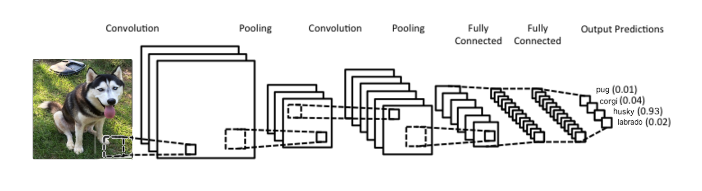
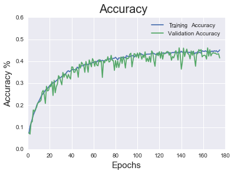
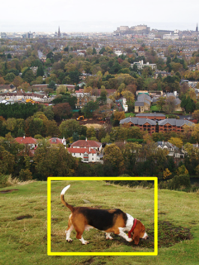
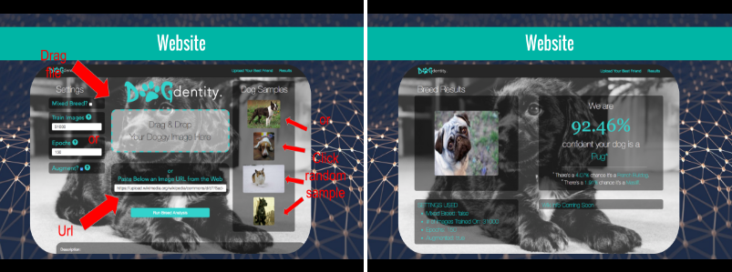

# 

## Overview
The goal of this project was to explore the proficiency of convolutional neural networks at identifying variations within canine breeds by images. DogDentity includes 36 unique breeds* and has validation accuracy of 47.8%; random guessing is 2.7%. Over 31,000 images scraped from image-net.org were used in training the neural network. Techniques such as image augmentation, further prevented overfitting and increase validation accuracy.

## Convlutional Neural Network

Looking at pixels individually has little to no valuable information for a person or a neural network. Pixels must be looked at together in groupings to have discernible features or values. This is why I used a Convolutional Neural Network. The convolutional layers process portions of the input image, called receptive fields. From these fields the neural network can learn features that generalize to images outside the training set. 

## Results

- 36 Breeds (most popular)
- Validation accuracy of 47.8%
- Random guessing is 2.7%
- Image Augmentations: Rotation, Zooming, Horizontal flipping

Image Augmentations drastically reduced overfitting.

## Future Work
Clean data is important, many of the collected images have extraneous background information that creates noise when training the model. By cropping the dataset using a trained OpenCV classifier, the model's accuracy could be significantly increased.

  
  

## Technologies Used
- [Python](https://www.python.org/)
- [Keras](http://keras.io/)
- [Theano](http://deeplearning.net/software/theano/)
- [OpenCV](http://opencv.org/)
- [AWS EC2](https://aws.amazon.com/)

## Website Demo

 API by Charles Lynn, Web Design by Chris Castro.

- [GitHub - DogDenity API](https://github.com/CharlesLynn/DogDenity_API)
- [GitHub - DogDenity Website](https://github.com/quadsurf/dogdentity)
- [DogDenity Website](http://dogdentity.com/static/index.html#/)

## *Included breeds:
Basset Hound, Husky, Beagle, King Charles Spaniel, Bernese Mountain Dog, Labrador, Border Collies, Mastiff, Boston Terrier, Minature Schnauzer, Boxer, Newfoundlands, Brittany Spaniel, Pointer Shorthaired, Chihuahua, Pomeranian, Cocker Spaniel, Poodle, Corgi, Pug, Dachshund, Rhodesian Ridgeback, Doberman, Rottweiler, English Bulldog, Shetland Sheepdog, French Bulldog, Shih Tzu, German Shepherd, Vizsla, Giant Schnauzer, Weimaraner, Golden Retrievers, West Highland White Terrier, Great Dane, Yorkshire Terrier.
