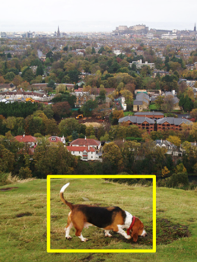

# 

## Overview
DogDentity is a two-week Data Science project, by Charles Lynn, done during the Galvanize immersive program. The goal of this project was to explore the proficiency of convolutional neural networks at identifying variations within canine breeds by images. DogDentity includes 36 unique breeds* and has validation accuracy of 47.8%; random guessing is 2.7%. Over 31,000 images scraped from image-net.org were used in training the neural network. Techniques such as image augmentation, further prevented overfitting and increase validation accuracy.

## Convlutional Neural Network

API and Backend including data collection, by Charles Lynn.

## Website Demo 
- [DogDenity API GitHub](https://github.com/CharlesLynn/DogDenity_API)
- [DogDenity Website (Under Construction!)](http://54.205.134.57:5000/static/dogdentity/public/index.html)

## Future Work
Clean data is important, many of the collected images have extraneous background information that creates noise when training the model. By cropping the dataset using a trained OpenCV classifier, the model's accuracy will be significantly increased.

## Technologies Used
- [python](https://www.python.org/)
- [Theano](http://deeplearning.net/software/theano/)
- [OpenCV](http://opencv.org/)
- [Keras](http://keras.io/)
- [AWS EC2](https://aws.amazon.com/)

*Included breeds:  Basset Hound, Husky, Beagle, King Charles Spaniel, Bernese Mountain Dog, Labrador, Border Collies, Mastiff, Boston Terrier, Minature Schnauzer, Boxer, Newfoundlands, Brittany Spaniel, Pointer Shorthaired, Chihuahua, Pomeranian, Cocker Spaniel, Poodle, Corgi, Pug, Dachshund, Rhodesian Ridgeback, Doberman, Rottweiler, English Bulldog, Shetland Sheepdog, French Bulldog, Shih Tzu, German Shepherd, Vizsla, Giant Schnauzer, Weimaraner, Golden Retrievers, West Highland White Terrier, Great Dane, Yorkshire Terrier.
